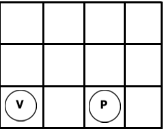

# MIN-MAX

This is an implementation of the MIN-MAX algorithm for the red and black board problem:



- There are two players: v (red) and b(black).
- Red plays first.
- There is a 4x4 board.
- Each player takes turn in adding a dot to the board.
  - The dot must be added to the lowest empty line index to the column the player desires.
- Should there be 3 dots for the same player horizontally, vertically or diagonally, that player wins.


- [MIN-MAX](#min-max)
  - [Requirements](#requirements)
  - [Run](#run)
  - [Limitations](#limitations)

## Requirements

- Ubuntu
- [Python 3.8.10](https://www.python.org/downloads/)

## Run

```bash
# Create virtual environment
python3 -m venv venv

# Activate virtual environment
source venv/bin/activate

# Run the code
# The code will be executed with the JSON related to the activity.
# Should you need to change the starting state, just update the src/input/sample_input.json file.
python main.py
```

You may find an example of the expected output on the `src/output` folder.

## Limitations

The algorithm expects the red player to be the next player to play (regardless of starting state).
The algorithm only uses 2 levels of depth.
